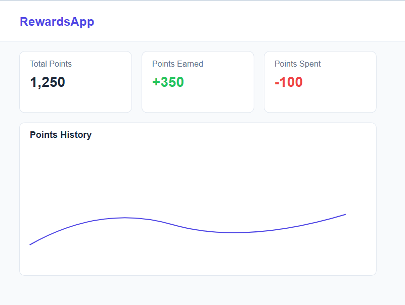
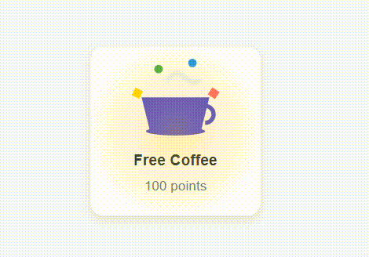
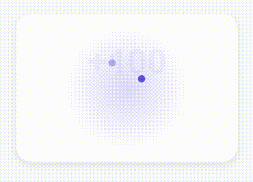
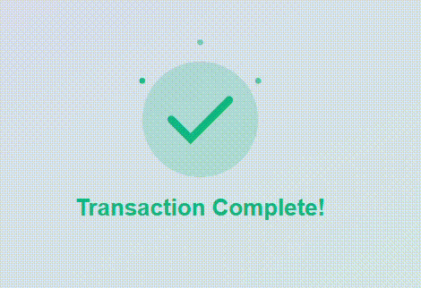

<div align="center">
  

  # Rewards Platform System
  
  [](https://reactjs.org/)
  [](https://tailwindcss.com/)
  [](https://redux-toolkit.js.org/)
  [](https://stripe.com/)
  [](LICENSE)
</div>

## ✨ Features

<!-- <div align="center">
  
</div> -->



- 💰 **Points Management**: Earn and spend points through various activities
- 💳 **Secure Payments**: Integrated Stripe payment processing
- ✨ **Elegant Animations**: Smooth reward animations using Framer Motion
- 📊 **Real-time Analytics**: Track spending patterns and reward metrics
- 📱 **Responsive Design**: Seamless experience across all devices

## 🚀 Working
<!-- 
<video src="working_ss/coffee-animation.mp4" controls width="800">
  Your browser does not support the video tag.
</video>

<video src="working_ss\points-animation.mp4" controls width="800">
  Your browser does not support the video tag.
</video>

<video src="working_ss\transaction-animation.mp4" controls width="800">
  Your browser does not support the video tag.
</video> -->



## 🔨 Tech Stack

- **Frontend**: React.js, TailwindCSS
- **State Management**: Redux Toolkit
- **Payments**: Stripe API
- **Animations**: Framer Motion
- **Charts**: Recharts
- **Build Tool**: Vite

## 📦 Installation

1. Clone the repository:
```bash
git clone https://github.com/oneshikaa/rewards-platform.git
```

2. Install dependencies:
```bash
cd rewards-platform
npm install
```

3. Create a `.env` file in the root directory:
```env
VITE_STRIPE_PUBLISHABLE_KEY=your_stripe_publishable_key
VITE_API_URL=http://localhost:3001
```

4. Start the development server:
```bash
npm run dev
```

## 🗰 Project Structure

```plaintext
src/
├── assets/           # Images, icons, etc.
├── components/       # Reusable components
│   ├── ui/          # Basic UI components
│   ├── layout/      # Layout components
│   └── features/    # Feature-specific components
├── pages/           # Page components
├── store/           # Redux store configuration
├── utils/           # Utility functions
├── services/        # API services
└── constants/       # Constants and configurations
```

## 💡 Usage

Here's a quick example of how to use the rewards system:

```javascript

import { useDispatch } from 'react-redux';
import { earnPoints } from '../store/slices/rewardsSlice';

const YourComponent = () => {
  const dispatch = useDispatch();

  const handleEarnPoints = async () => {
    await dispatch(earnPoints(100)).unwrap();
  };
};
```

## 📱 Screenshots

<div align="center">
  
  
</div>

## ⚙️ Configuration

### Stripe Setup

1. Create a Stripe account
2. Get your publishable key from the Stripe dashboard
3. Add the key to your `.env` file

### Environment Variables

```env
VITE_STRIPE_PUBLISHABLE_KEY=your_stripe_key
VITE_API_URL=your_api_url
```

## 📄 License

This project is licensed under the MIT License - see the [LICENSE](LICENSE) file for details.

## 👏 Acknowledgments

- [React Documentation](https://reactjs.org/)
- [Tailwind CSS](https://tailwindcss.com/)
- [Redux Toolkit](https://redux-toolkit.js.org/)
- [Stripe API](https://stripe.com/docs/api)
- [Framer Motion](https://www.framer.com/motion/)

